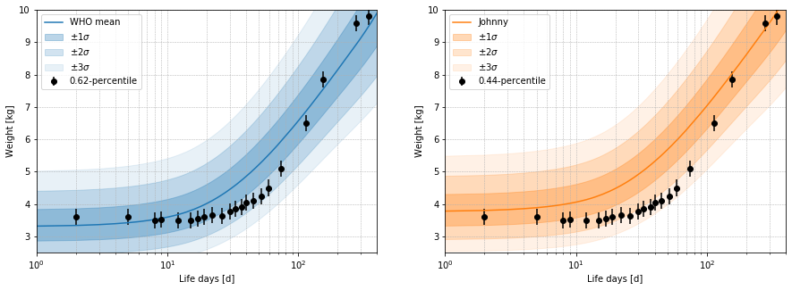

babystat
==============================

Tool calculating statistics about newborn/baby properties (weight, etc...) and including comparison to and evaluation with large WHO newborn database.

Copyright (c) 2018, Christopher Geis (ChG, [@gehbiszumeis](http://github.com)).

This project is licensed under the terms of the [GNU General Public License v3.0](LICENSE).

Contact: gehbiszumeis@gmx.de

Usage
------------

An instance of `babystat.Child` can be used to import and plot growth
 percentiles compared to the WHO mean as it is used at a pediatrician. 
 Suppose there is a boy named Johnny born on 2018/07/15. 

```python
from babystat import Child
# Instantiate new Child and retrieve WHO growth data
boy = Child(gender='male', birthday='2018-07-15', name='Johnny')
```

`babystat.Child` weight data has to be imported by an external file containing
 the measurement data in the following format. See [example file](https://github.com/gehbiszumeis/babystat/blob/master/weight_data_example.txt). 
 
 ```
date, measured_weight
2018-07-15, 3.81
2018-07-17, 3.60
2018-07-20, 3.60
2018-07-23, 3.50
```

```python
# Import Child weight data from external csv
df = boy.import_weight_data('weight_data_example.txt')
```

`babystast.Child` object has a `plot` method to plot the percentiles of
 Johnnys weight curve versus the WHO mean. See docstring for possible options
  for `mode`.

```python
# Calculate percentiles and plot
boy.plot(df, mode='both')
```



The left plot shows the measurement data over the percentile curves of the WHO
 mean and displays the actual percentile value of the child. The right plot
  shows the same data adjusted for the difference of Johnnys birth weight
   compared to the WHO mean.

